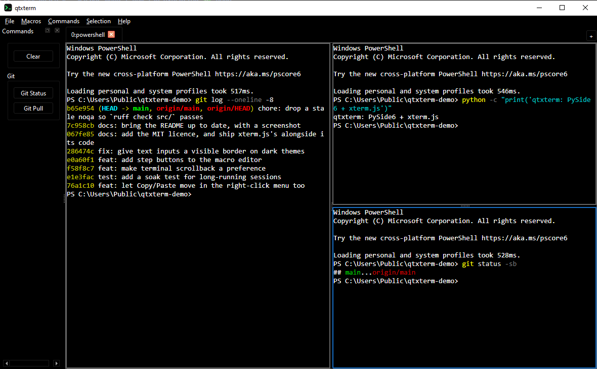

# qtxterm

[](https://github.com/rigidlab/qtxterm/actions/workflows/ci.yml)

A cross-platform tabbed terminal (Windows + Linux) built with PySide6, rendering
terminals via embedded [xterm.js](https://xtermjs.org/) in a `QWebEngineView`,
backed by real PTYs — ConPTY on Windows, `openpty` on Linux.



*One macro produced that layout: a tab split three ways, each pane running its
own command. Shown in the default theme — several dark themes ship with it.*

## Features

- **Tabs and split panes** — split any pane right or down, move panes within a
  tab or out into a tab of their own. Tabs carry tmux-style `{index}:{shell}`
  labels and can be renamed by double-clicking.
- **Any shell on the box** — PowerShell, Command Prompt, Git Bash, or a
  specific WSL distro, discovered at runtime and listed individually under
  **File → New Terminal**. Pick the one new tabs open with in Preferences.
- **Commands** — reusable one-liners sent to the terminal you're already
  working in, as one-click sidebar buttons and from the right-click menu.
- **Macros** — multi-step scripts that open their own tabs *and panes*. A
  `---` line splits a macro into steps, and `--- right` / `--- down` place a
  step in a split pane:

  ```
  npm run dev
  --- right
  npm run test:watch
  --- down
  git status
  ```

- **Selection Actions** — do something with the text you've selected: open it
  in a search URL, or feed it to a command on stdin. The selection is
  percent-encoded or written to a temp file rather than interpolated into a
  shell line, so a selection full of quotes and semicolons stays inert.
- **Browser tabs and panes** — put a page beside a terminal, for docs or a
  local dev server.
- **Themes and typography** — VS Code Dark High Contrast, Solarized and others
  applied to the terminal *and* the window chrome, plus font, font size, and
  how many lines of scrollback each terminal keeps.
- **Customizable right-click menu** — reorder its Copy/Paste, Pane, Command and
  Selection groups to taste.
- Window geometry, sidebar visibility, and preferences persist between runs.

## Install

No clone needed — [uv](https://docs.astral.sh/uv/) builds and installs it
straight from here:

```bash
uv tool install git+https://github.com/rigidlab/qtxterm.git
qtxterm
```

`pipx install git+https://github.com/rigidlab/qtxterm.git` and `pip install
git+...` work the same way.

That installs two commands: **`qtxterm`** (console, so it prints where you
ran it from) and **`qtxtermw`** (no console window — what a desktop shortcut
should point at). On Windows, `scripts/install-shortcut.ps1` creates Desktop
and Start Menu shortcuts with the app icon.

## Run from source

```bash
git clone https://github.com/rigidlab/qtxterm.git
cd qtxterm
uv sync
uv run qtxterm
```

To build and install your own wheel: `uv build`, then `uv tool install
dist/qtxterm-1.0.0-py3-none-any.whl`.

## Usage

The full guide is in the app under **Help → Usage**, or read
[`src/qtxterm/assets/USAGE.md`](src/qtxterm/assets/USAGE.md).

## Development

```bash
uv run pytest              # ~290 tests, a few seconds
uv run pytest -m soak      # long-session reliability, ~90s
uv run ruff check src/
```

CI runs the tests and lint on Windows and Linux for every push, and builds
the wheel. The soak test is excluded there - it is measured in minutes.

The soak test is the interesting one: it runs a compressed session — tabs,
panes, macros, theme and preset churn — in a loop around a terminal that is
never closed, and asserts that memory, GDI/USER and kernel handles, live
widgets and event-loop latency all stop climbing. `--soak-minutes 1440` runs
it for a day; `--soak-csv` dumps the curve.

[`SPEC.md`](SPEC.md) is the design record: what was decided, what was
measured, and why several obvious-looking approaches were rejected.

## License

MIT — see [`LICENSE`](LICENSE). Vendored xterm.js is MIT too, with its notice
alongside the code it covers in
[`src/qtxterm/assets/xterm/LICENSE`](src/qtxterm/assets/xterm/LICENSE).
